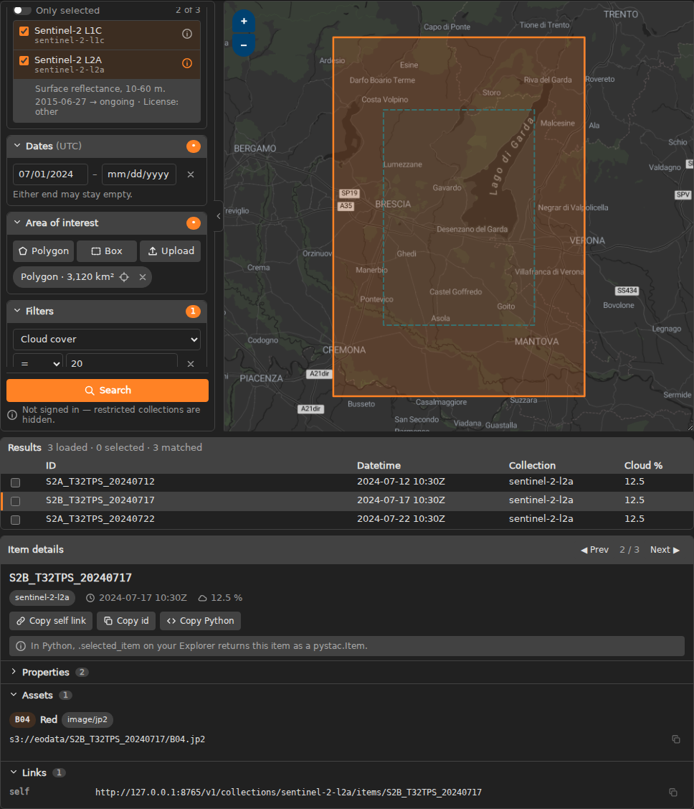

<p align="center"></p>

# jupyterlab-jstex — STAC explorer for JupyterLab

The package is `jupyterlab-jstex`; in Python you `import jstex`.

Find Earth-observation products on a map inside a notebook, then use them in
code. `jstex` is the light, notebook-native sibling of
STEX, the web EO Data Explorer. It offers collection search,
dates, one area of interest, attribute filters, a results table synchronised
with footprints on the map, and item details. Every result is also a `pystac`
object in Python.

Ready-made profiles set it up for CDSE, CREODIAS and CODE-DE. On a
JupyterHub, jstex searches with the signed-in user's own token, so restricted
collections just work. On your own computer you sign in from the widget. With
the `[s3]` extra, jstex also creates and renews S3 keys, so you can read and
download data from Python.



## Features

- **Search panel beside the map** (STEX-like). Drag the divider to resize it,
  fold it to an icon rail, or hide the map to work with just the panel and
  the results:
  - **Collections:** search by title or id, "only selected", ⓘ for the
    description, time extent and license.
  - **Dates and times (UTC):** a calendar with a 24-hour time picker, as in
    STEX, or type `YYYY-MM-DD [HH:MM]`; either end may be left open, and From
    after To is flagged.
  - **Area of interest:** one area. Draw a polygon or a box, or upload
    GeoJSON; invalid geometries are repaired before searching.
  - **Attribute filters:** built from the collections' queryables (`=`, `!=`,
    `<`, `<=`, `>`, `>=`, `IN`), checked by field type before sending.
- **Results ↔ map.** Clicking a row highlights its footprint. Clicking a
  footprint opens that item; where footprints overlap, a popup lists them, as
  in STEX.
- **Item details** (sections folded by default) with Prev/Next and copy
  buttons for:
  - the self link and id;
  - every property value;
  - asset hrefs, including alternates such as S3;
  - links;
  - a ready-to-run Python snippet, and a boto3 snippet per S3 asset.
- **Python access** to results, selection and the current query (see below).
- **Profiles** for CDSE, CREODIAS and CODE-DE, or your own catalogue (see
  [Profiles](#profiles)).
- **Restricted collections** with the user's own token. The token comes from
  JupyterHub, from a token you provide, or from **Sign in** in the widget
  (device login or password). A stored session carries over to later kernels.
  Without a token, jstex searches anonymously and shows "Not signed in".
- **S3 access** with keys that jstex creates, renews and shares between your
  kernels (`pip install "jupyterlab-jstex[s3]"`).
- **Light and dark mode** follow JupyterLab (also VS Code and Colab),
  including the basemap.
- **Links to the search**: `ex.query_url()` gives a clickable STAC
  `GET /search` URL; `ex.stex_url()` opens the same query in STEX.
- **Translatable** following the JupyterLab i18n standard; English ships
  today.

## Quick start

```python
import jstex

ex = jstex.Explorer()   # pick a collection, draw a box, click Search
ex
```

Then, in the next cell:

```python
item = ex.selected_item            # the item shown in Item details
item.assets["B04_10m"].href        # use it in your code
```

## Using results in Python

| Member                                                                                    | What it gives                                                                                                                                                                               |
| ----------------------------------------------------------------------------------------- | ------------------------------------------------------------------------------------------------------------------------------------------------------------------------------------------- |
| `jstex.Explorer(profile=None, stac_url=None, height=600)`                                 | The widget. `profile` selects a [profile](#profiles); `stac_url` overrides its STAC API; `height` is the panel/map height in px.                                                            |
| `ex.results`                                                                              | All loaded items as a `pystac.ItemCollection`                                                                                                                                               |
| `ex.selected_items`                                                                       | The checked result rows, as `pystac.Item`s                                                                                                                                                  |
| `ex.selected_item`                                                                        | The item shown in Item details (`None` if none)                                                                                                                                             |
| `ex.query`                                                                                | The current query as a dict. Assign to it to change the panel from Python.                                                                                                                  |
| `ex.search(wait=False)`                                                                   | Run the current query. `wait=True` blocks until `ex.results` is filled.                                                                                                                     |
| `ex.cancel()`                                                                             | Drop the running search; previous results stay                                                                                                                                              |
| `ex.query_url()`                                                                          | Clickable STAC `GET /search` URL for the query (returns the results as JSON; carries no token). A complex area is sent as its bbox, with a warning, to keep the URL under 2,000 characters. |
| `ex.stex_url()`                                                                           | Clickable STEX link that opens the query (needs `JSTEX_STEX_URL`)                                                                                                                           |
| `jstex.item(href, profile=None)`                                                          | Open any STAC item URL with the user's token (what "Copy Python" pastes)                                                                                                                    |
| `jstex.show_config(profile=None)`                                                         | The effective configuration: each field, its value and where it came from                                                                                                                   |
| `jstex.list_profiles()`                                                                   | The ready-made and your own profiles                                                                                                                                                        |
| `ex.whoami()`, `ex.login()`, `ex.logout()`, `ex.access_token()`, `ex.item(href)`, `ex.s3` | The same as the `jstex.*` functions below, always for this explorer's profile and settings                                                                                                  |
| `jstex.login()`, `logout()`, `whoami()`                                                   | Sign in, sign out, and how you are signed in (see [Signing in](#signing-in))                                                                                                                |
| `jstex.access_token(profile=None)`                                                        | Your current access token (or `None`), for your own HTTP requests                                                                                                                           |
| `jstex.help()`                                                                            | This list in the notebook, with a link to this README                                                                                                                                       |
| `jstex.use_profile(name)`                                                                 | Make `name` the kernel's default profile for the `jstex.*` functions and new explorers                                                                                                      |
| `jstex.s3.*`                                                                              | S3 clients and settings with managed keys (see [S3 access](#s3-access))                                                                                                                     |

Search from code, and the widget shows the same results:

```python
ex.query = {
    **ex.query,
    "collections": ["sentinel-2-l2a"],
    "datetime": {"from": "2024-07-01T00:00:00Z", "to": "2024-07-31T23:59:59Z"},
    "filters": [{"field": "eo:cloud_cover", "op": "<=", "value": 20}],
}
ex.search(wait=True)

for item in ex.results:
    print(item.id, item.datetime, item.properties.get("eo:cloud_cover"))
```

## Examples

Notebooks in [`examples/`](examples/) (stored without outputs; `pip install -r examples/requirements.txt`):

- [Download data](examples/01-download.ipynb) — selected assets over S3 or HTTPS, or a complete product.
- [Sentinel-2 NDVI with GDAL](examples/02-ndvi-gdal.ipynb) — read bands through `/vsis3/`, write a Cloud-Optimised GeoTIFF.
- [Working with xarray](examples/03-xarray.ipynb) — lazy bands, cloud mask, NDVI time series.

## Installation

```bash
pip install jupyterlab-jstex
```

In a JupyterHub single-user image:

```dockerfile
FROM quay.io/jupyter/scipy-notebook:latest
RUN pip install --no-cache-dir jupyterlab-jstex
```

Wheels are also attached to each [GitHub Release](https://github.com/alek-cesarz/jstex/releases).

Requirements: JupyterLab 4, Python ≥ 3.10 with `anywidget` 0.11 (installed
as a dependency).

## Profiles

A profile is a named set of settings for one platform: its STAC API, identity
service, sign-in options and S3 storage. jstex ships these:

| Profile                     | Platform                                                                         |
| --------------------------- | -------------------------------------------------------------------------------- |
| `cdse-opensearch` (default) | Copernicus Data Space Ecosystem, OpenSearch-backed STAC API                      |
| `cdse`                      | Copernicus Data Space Ecosystem, STAC API from the platform's discovery document |
| `creodias`                  | CREODIAS                                                                         |
| `codede`                    | CODE-DE                                                                          |

```python
jstex.list_profiles()                # names, descriptions and where each comes from
jstex.show_config()                  # effective settings: field, value, source
ex = jstex.Explorer(profile="cdse")  # use another profile for this widget
ex.whoami()                          # sign-in status for that profile
jstex.use_profile("cdse")            # the kernel's default from now on
```

Choose the profile with the `profile=` argument, `jstex.use_profile()`, the
`JSTEX_PROFILE` variable, or `profile =` in `~/.config/jstex/config.toml` (or
`/etc/jstex/config.toml` for everyone on a server), in that order. The default
is `cdse-opensearch`.

A profile belongs to the explorer it was given to. The `jstex.*` functions
(`jstex.whoami()`, `jstex.s3.client()`, …) use the kernel's default profile
unless you pass `profile=`, so with an explorer on another profile, use its
own methods: `ex.whoami()`, `ex.login()`, `ex.access_token()`, `ex.item()` and
`ex.s3.*`. `jstex.whoami()` lists the other profiles your explorers use.

Each setting is merged from these sources; later ones win:

1. the jstex profile registry (`jstex/data/profiles.json` on GitHub; cached
   for 24 h, with the copy in the package as fallback);
2. the platform's `eo-services.json` discovery document, when the profile
   names one;
3. `/etc/jstex/config.toml`, then `~/.config/jstex/config.toml`;
4. `JSTEX_*` environment variables;
5. arguments such as `jstex.Explorer(stac_url=…)`.

Set `JSTEX_PROFILES_URL=builtin` to work offline: jstex then uses only the
packaged registry and skips discovery.

### Your own profile

`config.toml` uses the field names from the table below. A table for an
existing profile changes only the fields it sets:

```toml
# ~/.config/jstex/config.toml
profile = "my-catalogue"

[profiles.my-catalogue]            # own profile; may also set `discovery`
stac_url = "https://stac.example.org/v1/"
issuer = "https://id.example.org/auth/realms/example"
login_client_id = "my-device-client"
s3_endpoint = "https://s3.example.org"
s3_keys_url = "https://keys.example.org/api/user"
s3_bucket = "data"

[profiles.cdse-opensearch]         # overrides fields of the ready-made profile
stex_url = "https://stex.example.org/"
```

`profile = "none"` loads no ready-made profile; set at least `stac_url`
yourself (in `[profiles.none]`, `JSTEX_STAC_URL` or `stac_url=`).

If you point `stac_url` at a catalogue on another host than the profile's,
jstex does not sign in to it with the profile's identity service (your token
would otherwise go to that host): searches there are anonymous unless you also
set `issuer` (`JSTEX_OIDC_ISSUER` or `issuer=`).

## Configuration

Every setting can also come from an environment variable, e.g. on a server
through `singleuser.extraEnv` in Zero to JupyterHub. Unset variables keep the
profile's value.

| Field / env var                                                    | Meaning                                                                                                                                            |
| ------------------------------------------------------------------ | -------------------------------------------------------------------------------------------------------------------------------------------------- |
| `JSTEX_PROFILE`                                                    | Profile to use (default `cdse-opensearch`)                                                                                                         |
| `JSTEX_PROFILES_URL`                                               | Other profile registry URL, or `builtin` for no network                                                                                            |
| `stac_url` / `JSTEX_STAC_URL`                                      | STAC API                                                                                                                                           |
| `stex_url` / `JSTEX_STEX_URL`                                      | STEX base URL for `stex_url()` links                                                                                                               |
| `issuer` / `JSTEX_OIDC_ISSUER`                                     | Identity service (OpenID Connect issuer URL)                                                                                                       |
| `login_client_id` / `JSTEX_LOGIN_CLIENT_ID`                        | Client id for device login                                                                                                                         |
| `password_client_id` / `JSTEX_PASSWORD_CLIENT_ID`                  | Client id for password login                                                                                                                       |
| `password_login` / `JSTEX_PASSWORD_LOGIN`                          | Offer password login (`true`/`false`)                                                                                                              |
| `offline_access` / `JSTEX_OFFLINE_ACCESS`                          | Ask for a long-lived session (`offline_access` scope)                                                                                              |
| `s3_endpoint` / `JSTEX_S3_ENDPOINT`                                | S3 endpoint                                                                                                                                        |
| `s3_region` / `JSTEX_S3_REGION`                                    | S3 region                                                                                                                                          |
| `s3_keys_url` / `JSTEX_S3_KEYS_URL`                                | The platform's S3 keys manager                                                                                                                     |
| `s3_bucket` / `JSTEX_S3_BUCKET`                                    | Bucket used to check that a new key works                                                                                                          |
| `JSTEX_TRACEBACK`                                                  | `1` shows the full Python traceback for jstex errors (normally one line, e.g. `JstexQueryError: Select at least one collection before searching.`) |
| `JSTEX_ACCESS_TOKEN`                                               | Access token to use (local development, scripts)                                                                                                   |
| `JSTEX_BASEMAP_LIGHT_URL` / `_KEY` / `_KEY_PARAM` / `_ATTRIBUTION` | Light-theme basemap (default OpenFreeMap Positron, no key needed)                                                                                  |
| `JSTEX_BASEMAP_DARK_URL` / `_KEY` / `_KEY_PARAM` / `_ATTRIBUTION`  | Dark-theme basemap (default OpenFreeMap Positron, no key needed)                                                                                   |

The default basemap is [OpenFreeMap](https://openfreemap.org) Positron
(`https://tiles.openfreemap.org/styles/positron`) in both themes; it needs no
API key. Each theme can use another provider:

- `_URL`: an XYZ raster tile template (contains `{z}/{x}/{y}`; `{r}` becomes
  `@2x`), or any other URL is read as a MapLibre/Mapbox style JSON (vector).
- `_KEY` / `_KEY_PARAM`: an API key, added to the URL as `?<KEY_PARAM>=<KEY>`
  (default parameter name `key`).
- `_ATTRIBUTION`: credits shown for raster tiles; a vector style brings its
  own credits from its sources.

## Signing in

jstex uses the first of these that gives a token for the profile's identity
service:

1. a token you provide: `JSTEX_ACCESS_TOKEN` (skipped if it was issued by
   another identity service) or `jstex.login(token=…)`;
2. JupyterHub — only when the hub signs you in with the profile's identity
   service (a profile without one never gets the hub token);
3. a stored session from an earlier sign-in (also in other kernels);
4. **device login** — open a link, confirm a code, sign in in your browser
   (any login method, including two-factor);
5. **password login**, where the profile allows it;
6. otherwise anonymous: public collections only.

Steps 4 and 5 start when you click **Sign in** under the Search button, or run:

```python
jstex.login()                     # device login if possible, else password
                                  # (ex.login() for an explorer's own profile)
jstex.login(method="password")    # username and password
jstex.whoami()                    # how you are signed in, shown as a list:
                                  #   Profile:    cdse-opensearch
                                  #   Signed in:  session
                                  #   User:       alice
                                  #   Expires:    2026-10-07 16:42:10 CEST (in 52 min)
jstex.logout()                    # forget the stored session
```

- **Device login** needs a client id that the identity service allows to use
  device login. It comes from the profile, the discovery document or your
  configuration. When none is set, jstex asks for one; the id you enter is
  remembered with the session, and `jstex.login(client_id=…, save=True)` also
  writes it to `~/.config/jstex/config.toml`.
- **Password login** does not work for accounts that sign in with two-factor
  or social login; use device login for those. When the notebook page is not
  served over HTTPS, the widget warns that the password would cross the
  network unencrypted. The password is sent once to the identity service and
  never stored.
- **Sessions** are kept in `~/.local/share/jstex/sessions.json` (only you can
  read it). It holds the refresh token, never the password or the access token.
- jstex sends your token only to the profile's own STAC API, identity service
  and S3 keys manager. `jstex.access_token()` gives it to you for your own
  requests (e.g. HTTPS downloads); where you send it is up to you.

### JupyterHub prerequisites

To use the hub's token, the hub must:

- enable `auth_state`;
- grant `admin:auth_state!user` so the user's server can read it.

See [`deploy/z2jh-values.example.yaml`](deploy/z2jh-values.example.yaml).
Without this, users can still click **Sign in**.

## S3 access

```bash
pip install "jupyterlab-jstex[s3]"
```

jstex creates S3 keys through the platform's keys manager when you first need
one. Keys are valid for 8 hours; jstex renews them when less than an hour is
left, deletes the old one, and shares one key between your kernels. You need to
be signed in.

```python
item = ex.selected_item
asset = item.assets["B04_10m"]

loc = ex.s3.location(asset)                  # {'Bucket': 'eodata', 'Key': 'Sentinel-2/…'}
ex.s3.client(asset).download_file(**loc, Filename="B04.jp2")   # boto3 client
ex.s3.session()                              # boto3 Session (keys renew themselves)

import s3fs                                  # fsspec / s3fs
fs = s3fs.S3FileSystem(**ex.s3.storage_options(asset))

import os                                    # GDAL, rasterio, rioxarray: /vsis3/…
os.environ.update(ex.s3.gdal_env(asset))

ex.s3.write_s3_profile("jstex")              # S3 profile "jstex" for other tools
```

`ex.s3` uses the explorer's profile; `jstex.s3.client()`, `location()`,
`session()`, `storage_options()`, `gdal_env()` and `write_s3_profile()` do the
same for the kernel's default profile (or `profile=`).

`write_s3_profile()` writes the key and endpoint to the shared S3 credentials
files (`~/.aws/credentials` and `~/.aws/config`; the "aws" is only the
files' conventional location). boto3, the AWS CLI, R (`aws.s3`, `paws`),
Julia (`AWS.jl`), GDAL (`AWS_PROFILE=jstex`), rclone and s5cmd read them for
any S3 storage.

`client()` and `session()` renew their key on their own. `storage_options()`,
`gdal_env()` and `write_s3_profile()` return a fixed key valid for up to 8
hours; call them again for a fresh one. In Item details, **Copy boto3
snippet** next to an S3 asset gives code that downloads it.

If the platform refuses a new key because you have too many, jstex says "S3 key
limit reached"; remove unused keys in the platform's S3 keys manager and retry.

## Translations

The UI uses JupyterLab's translation system (gettext domain `jstex`). jstex
ships English only. A translation is shown when the matching official
JupyterLab language pack (e.g. `jupyterlab-language-pack-de-DE`) is installed
and selected. To add a language, see
[DEVELOPMENT.md → Translations](DEVELOPMENT.md#translations-i18n).

## Limitations

- While another cell is running, the widget waits for the kernel.
- There is one area of interest at a time.
- There is no "Load more" yet; a search loads one page (50 items).
- The widget has no download manager, visualisation or processing. Download
  from Python (see [S3 access](#s3-access) and the [examples](examples/)), or
  use STEX.

## Documentation

- [Architecture](docs/architecture.md) — how the kernel, widget and
  JupyterLab extension fit together.
- [DEVELOPMENT.md](DEVELOPMENT.md) — setup, commands, gotchas.
- [CONTRIBUTING.md](CONTRIBUTING.md) — development install and releasing.
- [CHANGELOG.md](CHANGELOG.md)

## License

[GPL-3.0-or-later](LICENSE). The extension bundles third-party open-source
libraries (e.g. OpenLayers, EOX Elements) under their own licenses.
