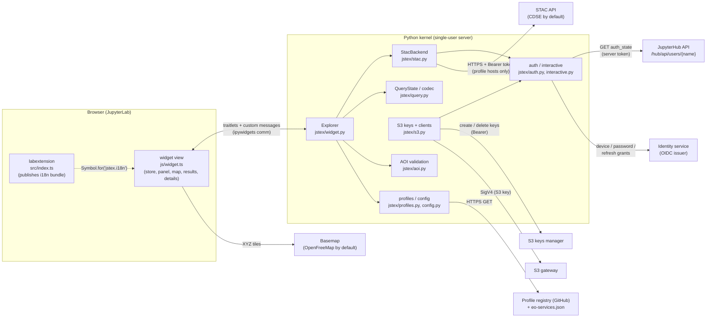
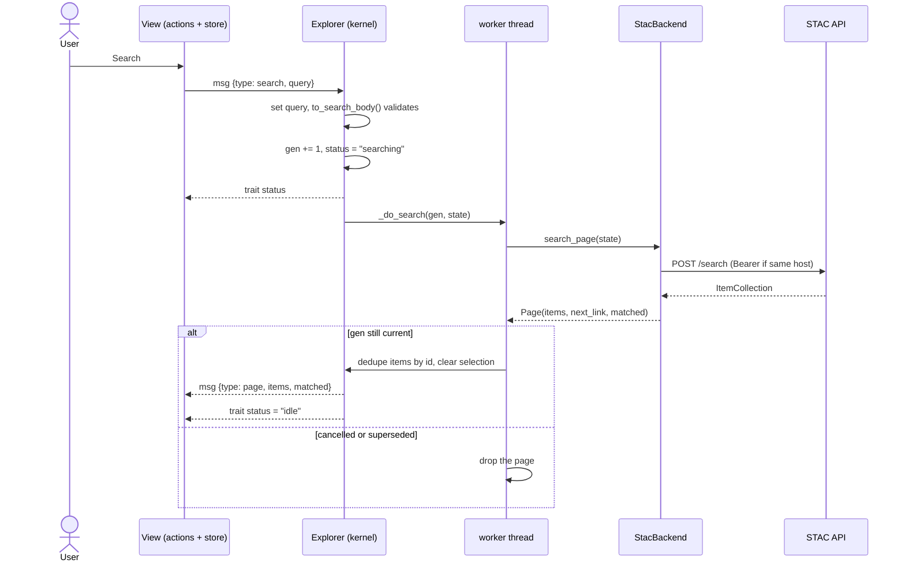
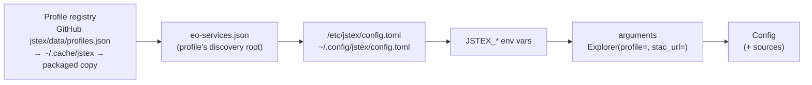
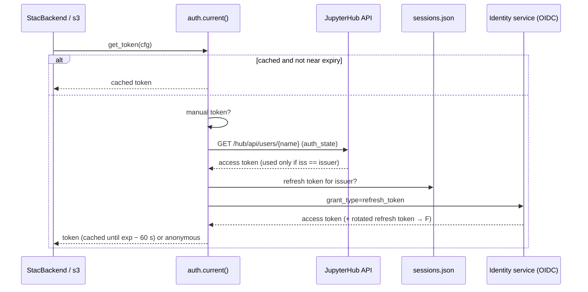

# jstex architecture

This document describes how jstex is built: what runs where, how the parts
talk to each other, and why. For setup, commands and gotchas see
[DEVELOPMENT.md](../DEVELOPMENT.md); for what users get see the
[README](../README.md).

## 1. Scope

jstex is a STAC explorer that lives inside a notebook cell. A user picks
collections, dates, one area of interest and attribute filters, searches a
STAC API, browses results on a map and in a table, and copies item links,
property values and asset hrefs — or reads the results in Python as `pystac`
objects.

Out of scope: a download manager, visualisation, processing and workspaces
(those stay in STEX). Data is read and downloaded from Python with the S3
helpers (`jstex.s3`).

Stage 1 (v0.1) delivered the in-cell widget. The v0.2 base adds profiles,
sign-in without JupyterHub and managed S3 keys (§9). Later: "Load more" and
a JupyterLab side panel with a REST backend (stage 3).

## 2. The one rule: the kernel owns traffic and secrets

Every STAC request is made by the Python kernel. The browser only renders.

- The user's access token is obtained in the kernel — from JupyterHub, a
  stored session, or a device/password login — and is never sent to the
  browser. Only the password typed into the sign-in form crosses the comm,
  once.
- The same code path serves the widget and plain Python (`ex.search()`,
  `jstex.item(href)`), so what the widget shows is exactly what Python gets.
- The browser talks to only two kinds of servers: the Jupyter server (widget
  comms) and the basemap tile servers. (Device login opens the identity
  service's page in a new browser tab; that is the user's own browser
  session, not the widget.)

## 3. What ships in the wheel

One wheel, `jupyterlab_jstex-<version>-py3-none-any.whl` (distribution
`jupyterlab-jstex`, import package `jstex`), contains four things:

| Artefact                                                        | Source                                    | Built by                                 | Loaded by                                                   |
| --------------------------------------------------------------- | ----------------------------------------- | ---------------------------------------- | ----------------------------------------------------------- |
| Python package `jstex`                                          | `jstex/*.py`, `jstex/data/profiles*.json` | hatchling                                | the kernel (`import jstex`)                                 |
| Widget bundle `jstex/static/widget.{js,css}`                    | `js/`                                     | Vite library build (`jlpm build:widget`) | anywidget, from a blob URL, once per `Explorer()`           |
| JupyterLab extension `jupyterlab-jstex` (`jstex/labextension/`) | `src/index.ts`, `src/icon.ts`, `style/`   | `tsc` + `jupyter-builder`                | JupyterLab at page load                                     |
| Translations `jstex/locale/`                                    | `js/strings.ts` → `jstex.pot`             | `jupyterlab-translate`                   | the Jupyter server, via the `jupyterlab.locale` entry point |

Notes:

- **Widget bundle.** It must be a single ES module: anywidget imports it from
  a blob URL, so no code-split chunks (`inlineDynamicImports`) and one CSS
  file. It is about 4.2 MB (1.1 MB gzip) because it includes OpenLayers and
  the EOX Elements.
- **Why a labextension at all.** The widget is not a JupyterLab plugin and
  cannot request `ITranslator`. In stage 1 the labextension loads the `jstex`
  translation bundle and publishes it for the widget (§14), and registers the
  extension icon: STEX's logo as the LabIcon `jupyterlab-jstex:logo`
  (`src/icon.ts`, exported as `stexIcon` for the stage-3 panel/launcher).
- **Server extension.** `jstex/routes.py` and `src/request.ts` are the
  extension template's authenticated `/jstex/hello` route. They are kept as
  the scaffold for stage 3's REST backend and are unused by the widget.

## 4. Python modules

| Module                 | Responsibility                                                                                                                                                                                              |
| ---------------------- | ----------------------------------------------------------------------------------------------------------------------------------------------------------------------------------------------------------- |
| `jstex/__init__.py`    | Lazy exports (`Explorer`, `item`, `show_config`, `list_profiles`, `login`, `logout`, `whoami`, `access_token`, `s3`) so the server can import the package cheaply (the translation entry point imports it). |
| `jstex/widget.py`      | `Explorer` (anywidget): synced traitlets, the message handler, search generations, Python accessors.                                                                                                        |
| `jstex/stac.py`        | `StacBackend`: every HTTP call to STAC, via pystac-client's `StacApiIO`: collections (paged), queryables (cached, merged), search, `rel=next`, item read. Retries, error messages.                          |
| `jstex/auth.py`        | Token chain per issuer: manual token → hub `auth_state` (issuer must match) → stored session → anonymous (§9.2). Caching, refresh, forced refresh, logout.                                                  |
| `jstex/oidc.py`        | OpenID Connect discovery (`.well-known/openid-configuration`, cached) and token-endpoint requests; `OidcError`.                                                                                             |
| `jstex/sessions.py`    | `SessionStore`: refresh tokens per issuer in `~/.local/share/jstex/sessions.json` (0600, atomic writes).                                                                                                    |
| `jstex/interactive.py` | Device login (RFC 8628 + PKCE) and password login, run on user action; one login at a time.                                                                                                                 |
| `jstex/profiles.py`    | Profile registry (GitHub → cache → packaged) and `eo-services.json` discovery: fetch, cache, validate, flatten (§9.1).                                                                                      |
| `jstex/s3.py`          | S3 key manager (create, renew, cache, lock) and the helpers `client`, `session`, `location`, `storage_options`, `gdal_env`, `write_aws_profile` (§9.4).                                                     |
| `jstex/query.py`       | `QueryState`, the STEX-compatible `?q=` codec, and `to_search_body()` (QueryState → STAC `/search` body incl. CQL2-JSON).                                                                                   |
| `jstex/aoi.py`         | GeoJSON upload validation and normalisation; geometry repair (`make_valid`).                                                                                                                                |
| `jstex/config.py`      | `load_config()`: registry profile → discovery → config files → `JSTEX_*` env vars → arguments, with each field's source. Basemaps. `ConfigView` for `show_config()`.                                        |
| `jstex/api.py`         | Public helpers: `item(href)` (used by copied snippets), `show_config`, `list_profiles`, `login`, `logout`, `whoami`, `access_token`.                                                                        |
| `jstex/errors.py`      | `JstexError` → `JstexAuthError`, `JstexStacError(status)`, `JstexQueryError`.                                                                                                                               |

## 5. Front-end modules

The widget is framework-free TypeScript: a small observable store plus views
that render into plain DOM, with EOX custom elements for the map.

| Module                                                                     | Responsibility                                                                                                                   |
| -------------------------------------------------------------------------- | -------------------------------------------------------------------------------------------------------------------------------- |
| `js/define-guard.ts`                                                       | **First import.** Makes re-defining a custom element a no-op (each `Explorer()` re-evaluates the bundle).                        |
| `js/widget.ts`                                                             | anywidget `render()`: builds the layout, creates one store, backend and actions per view, mounts the views, returns the cleanup. |
| `js/store.ts`                                                              | `createStore()`: `get` / `set(patch)` / `subscribe((state, prev) => …)`.                                                         |
| `js/types.ts`                                                              | Shared types; mirrors the Python protocol.                                                                                       |
| `js/backend.ts`                                                            | `Backend` interface and `CommBackend` (request/reply over custom messages; search is push-based).                                |
| `js/model-sync.ts`                                                         | Initial state from the model; mirrors trait changes into the store; applies result pages.                                        |
| `js/actions.ts`                                                            | User intents. The only place views change state or talk to the backend.                                                          |
| `js/filters.ts`                                                            | Pure filter logic: operators by field type, value parsing, validation, rows ↔ predicates.                                        |
| `js/format.ts`                                                             | Formatting and geometry helpers (bbox, area, dates, footprint features).                                                         |
| `js/antimeridian.ts`                                                       | Splits footprints crossing ±180° (copied from STEX).                                                                             |
| `js/theme.ts`                                                              | Host theme detection and watching; basemap layer.                                                                                |
| `js/i18n.ts`, `js/strings.ts`                                              | Translation lookup; every UI string as a literal `trans.__()` call.                                                              |
| `js/selection.ts`, `js/clipboard.ts`, `js/snippets.ts`, `js/icons.ts`      | Small helpers.                                                                                                                   |
| `js/ui/panel.ts`                                                           | Search panel: collapsible sections, pinned Search button with a "why disabled" hint, collapse to an icon rail.                   |
| `js/ui/section.ts`                                                         | Generic collapsible section (caret, title, summary, badge).                                                                      |
| `js/ui/layout.ts`                                                          | Theme and height, the panel/map splitter (drag, arrow keys, double-click resets) and the collapsible map.                        |
| `js/ui/collections.ts`, `dates.ts`, `aoi-section.ts`, `filters-section.ts` | The four panel sections. Dates use `vanilla-calendar-pro` (as STEX) for the date + 24 h time popup.                              |
| `js/ui/map.ts`                                                             | `eox-map` + `eox-drawtools`: basemap, AOI, footprints, highlight; click-to-activate; drawing.                                    |
| `js/ui/footprint-popup.ts`                                                 | List of items under a clicked point when footprints overlap.                                                                     |
| `js/ui/results.ts`                                                         | Results table (checkbox selection, row activation).                                                                              |
| `js/ui/details.ts`                                                         | Item details: header actions, Prev/Next, Properties / Assets / Links with copy buttons; boto3 snippet per S3 asset.              |
| `js/ui/signin.ts`                                                          | Panel footer sign-in line and the inline sign-in area (device code, client id, password form) (§9.3).                            |

Everything is per view: nothing is module-global except the define guard and
the translation lookup. That is why two explorers (or two views of one
explorer) in a notebook are independent.

## 6. The widget protocol

Two channels connect a view and its `Explorer`.

### 6.1 Synced traitlets (small state, both directions)

| Trait             | Type                                                                   | Written by                | Meaning                                                            |
| ----------------- | ---------------------------------------------------------------------- | ------------------------- | ------------------------------------------------------------------ |
| `query`           | dict                                                                   | JS (on Search) and Python | The QueryState dict (same keys as `QueryState.to_dict()`).         |
| `selected_ids`    | list[str]                                                              | JS                        | Checked result rows → `ex.selected_items`.                         |
| `active_id`       | str \| None                                                            | JS                        | Item shown in details → `ex.selected_item`.                        |
| `status`          | `idle` \| `searching` \| `error`                                       | Python                    | Search state.                                                      |
| `error`           | str                                                                    | Python                    | Message for the error banner.                                      |
| `auth_source`     | `token` \| `hub` \| `session` \| `device` \| `password` \| `anonymous` | Python                    | How the user is signed in; drives the sign-in line.                |
| `auth_user`       | str                                                                    | Python                    | User name from the token, for the sign-in line.                    |
| `profile_name`    | str                                                                    | Python                    | Active profile, shown next to the sign-in line.                    |
| `login_methods`   | list[`device` \| `password`]                                           | Python                    | Sign-in methods the profile allows; empty hides **Sign in**.       |
| `can_cancel`      | bool                                                                   | Python                    | False when searches run synchronously.                             |
| `map_height`      | int                                                                    | Python / JS               | Panel + map height (drag-resizable).                               |
| `basemap`         | dict                                                                   | Python                    | Light/dark URL (key applied), attribution, `kind` (`style`/`xyz`). |
| `panel_collapsed` | bool                                                                   | JS                        | Panel folded to the rail.                                          |
| `panel_width`     | int                                                                    | JS / Python               | Search panel width in px (divider drag; clamped by layout).        |
| `map_collapsed`   | bool                                                                   | JS / Python               | Map folded to a rail (never together with `panel_collapsed`).      |

### 6.2 Custom messages (requests and large payloads)

Results are sent as messages, not traits: one page of CDSE items can be
several MB, and a trait would be stored in, and re-sent with, the widget
state.

| Direction | `type`                       | Payload                           | Answer                                                          |
| --------- | ---------------------------- | --------------------------------- | --------------------------------------------------------------- |
| JS → Py   | `collections`                | `req_id`                          | `reply` with `[{id, title, description, license, start, end}]`  |
| JS → Py   | `queryables`                 | `req_id`, `collections`           | `reply` with the fields shared by all collections               |
| JS → Py   | `aoi_upload`                 | `req_id`, `text`                  | `reply` with one Polygon/MultiPolygon, or an error              |
| JS → Py   | `search`                     | `query`                           | none directly; `status` changes, then `page`                    |
| JS → Py   | `cancel`                     | —                                 | `status` → `idle`                                               |
| JS → Py   | `sync`                       | —                                 | `page` with the current results (a re-rendered view catches up) |
| Py → JS   | `reply`                      | `req_id`, `ok`, `data` \| `error` | resolves/rejects the pending request                            |
| Py → JS   | `page`                       | `items`, `matched`                | replaces the view's results                                     |
| both      | `login_*`, `logout`, `login` | see §9.3                          | sign-in flow                                                    |

Every request gets a `reply`: the handler catches all exceptions and turns
them into `ok: false`, so the UI never waits forever on a failed request.

## 7. Search flow

Design points:

- **Push-based.** Results always arrive as `page` messages, whoever started
  the search. `ex.search()` from Python updates every open view the same way.
- **Worker thread.** Searches run on a daemon thread (`thread_runner`), so the
  kernel stays free and Cancel works. The stage-1 spike showed that `send()`
  and trait updates from a thread reach the browser reliably (ipykernel 7.4);
  `spike.spec.ts` guards it. `sync_runner` exists as a fallback and sets
  `can_cancel = False`.
- **Cancel = generation counter.** `cancel()` and every new search increment
  `_gen` under a lock. A finishing search whose generation is stale is dropped;
  previous results stay. The HTTP request itself is not aborted.
- **Kernel busy.** Comm messages are handled by the kernel's main loop, so
  while another cell runs, the widget waits.

### 7.1 From QueryState to `/search`

`to_search_body()` in `jstex/query.py`:

| QueryState                 | Request body                                                                                                                   |
| -------------------------- | ------------------------------------------------------------------------------------------------------------------------------ |
| `collections` (required)   | `collections`                                                                                                                  |
| `pageSize`                 | `limit`                                                                                                                        |
| `datetime` with either end | `datetime: "from/to"`; a missing end becomes `1900-01-01T00:00:00Z` or `2099-12-31T23:59:59Z` (the CDSE firewall rejects `..`) |
| selected `aois`            | `intersects`: the geometry after `repair()`; several (only possible from a STEX link) are unioned                              |
| `filters`                  | `filter` (CQL2-JSON) + `filter-lang: cql2-json`; one predicate or `and`; `!=` → `<>`, `IN` → `in` (CDSE rejects the others)    |

`sort` is kept in the QueryState for STEX compatibility but not sent.

## 8. State model

There are three layers of state, each with a clear owner:

1. **Kernel (source of truth).** The traitlets in §6.1 plus `_items` (the
   loaded items by id) and `_page`. The Python accessors read from here.
2. **View store (`ExplorerState`, `js/types.ts`).** A per-view copy of the
   traits, plus the results from `page` messages and derived data (collections
   list, filter fields). `model-sync.ts` keeps it in step: trait changes made
   in Python are mirrored into the store; `applyPage` replaces the items and
   keeps selection that still refers to loaded items.
3. **UI-only state (in the store, never synced).** Filter builder rows with
   their raw text and errors, open/closed sections, the active draw tool, AOI
   upload errors. Only valid filter rows are committed to `query.filters`.

Views subscribe to the store and re-render the parts they own. They change
state only through `Actions`; an action updates the store and, where Python
cares, sets the trait and calls `save_changes()`.

### 8.1 Links: GET search URL and STEX link

`ex.query_url()` (`search_get_url()` in `jstex/query.py`) turns the same
`to_search_body()` result into a STAC `GET /search` URL:

- `collections` comma-joined, `limit` and `datetime` as-is;
- `intersects` and `filter` as compact JSON, with `filter-lang=cql2-json`;
- coordinates rounded to 6 decimals.

CDSE answers the GET form exactly like the POST (verified 2026-09-30), but its
firewall rejects URLs over about 2,000 characters with an HTML "Request
Rejected" page. When the area pushes the URL over `MAX_GET_URL_LENGTH` (2,000),
the link sends the area's `bbox` instead and warns that it may return extra
items. The URL carries no token, so restricted collections need a signed-in
client. Both methods return a `Url` (a `str` with `_repr_html_`), which
notebooks show as a clickable link.

`QueryState` is the same shape as STEX's (`collections`, `datetime`, `aois`,
`filters`, `sort`, `pageSize`). `ex.stex_url()` (needs `JSTEX_STEX_URL`)
encodes it with the STEX `?q=` codec: base64url JSON, compact AOIs `[{g, s}]`, defaults omitted,
coordinates rounded to 6 decimals with JavaScript `Math.round` semantics. The
codec is tested against golden strings produced by STEX's own encoder
(`tests/fixtures/stex_codec_golden.json`), so a link opens the same search in
STEX.

## 9. Profiles, authentication and S3

### 9.1 Profiles and configuration

A profile names one platform's settings: STAC API, identity service, sign-in
options, S3 endpoint and keys manager. `load_config()` (`jstex/config.py`)
builds one `Config` per call and records where each field came from
(`Config.sources`, shown by `jstex.show_config()`):

- **Selection.** `profile=` argument → `JSTEX_PROFILE` → `profile =` in the
  user file, then the system file → `cdse-opensearch`. `none` loads no
  ready-made profile.
- **Merge (later wins).** The registry entry, then the discovery document
  except the entry's `pinned` fields (`cdse-opensearch` pins its OpenSearch
  STAC URL), then `[profiles.<name>]` tables in the config files, then
  `JSTEX_*` variables, then arguments. Only `profile` and `[profiles.*]`
  tables are read from the files. A profile defined only in a config file may
  name its own `discovery` root.
- **Mapping.** `profiles.DISCOVERY_PATHS` maps eo-services paths
  (`services.catalogue.stac.url`, `services.auth.issuer`,
  `services.auth.client_id` → `password_client_id`,
  `services.auth.device_client_id` → `login_client_id`,
  `services.data_access.s3.*`) to the flat `Config` fields;
  `profiles.PROFILE_PATHS` does the same for registry entries (their `jstex`
  block holds jstex-only fields such as `login_client_id`, `password_login`
  and `s3_bucket`). Discovery's `client_id` is never used for device login.
- **Fetching.** The registry and each discovery document are fetched at most
  once per kernel (3 s timeout), cached on disk for 24 h in `~/.cache/jstex/`,
  and the cache is the fallback when a fetch fails; the registry's last
  fallback is the packaged copy. Invalid entries (schema
  `jstex/data/profiles.schema.json`; every URL `https`) are skipped with one
  warning. `JSTEX_PROFILES_URL=builtin` disables the network.

### 9.2 Token chain

`auth.current(cfg)` returns a `TokenInfo(token, source, expires_at, user)` for
the profile's issuer, from the first source that has one:

| #   | Source      | How                                                                                   |
| --- | ----------- | ------------------------------------------------------------------------------------- |
| 1   | `token`     | `JSTEX_ACCESS_TOKEN` or `jstex.login(token=…)`                                        |
| 2   | `hub`       | JupyterHub `auth_state` — only if the JWT's `iss` equals the profile's `issuer`       |
| 3   | `session`   | a stored refresh token for this issuer, exchanged for an access token                 |
| 4   | `device`    | device login (user action: Sign in or `jstex.login()`)                                |
| 5   | `password`  | password login, where `password_login` and `password_client_id` are set (user action) |
| 6   | `anonymous` | none of the above                                                                     |

- **Hub token.** OAuthenticator keeps the user's OIDC tokens in the encrypted
  `auth_state`. The single-user server reads it with its own API token, which
  needs the RBAC scope `admin:auth_state!user`, from `/hub/api/users/{name}`
  (`/hub/api/user` returns `auth_state: null`, jupyterhub#5103). Its `iss` is
  read from the JWT payload without verifying the signature: it only decides
  routing; the services verify the token.
- **Sessions** (`jstex/sessions.py`): `~/.local/share/jstex/sessions.json`
  (0600, directory 0700, atomic writes), one entry per issuer: client id,
  refresh token, its expiry and the login method. Access tokens stay in
  memory. A refresh that rotates the refresh token stores the new one;
  `invalid_grant` drops the session, unless another kernel has meanwhile
  replaced it, in which case jstex retries with the new one.
- **Device login** (`jstex/interactive.py`): RFC 8628 with PKCE S256 against
  the issuer's `device_authorization_endpoint` (from
  `.well-known/openid-configuration`, `jstex/oidc.py`), scope `openid` (plus
  `offline_access` when configured). It honours `interval` and `slow_down` and
  stops after `expires_in` or 5 minutes. The client id comes from
  `login_client_id` or the user (remembered with the session; `save=True`
  writes it to the config file). `unauthorized_client` means the client may
  not use device login: the UI offers password login if allowed, else asks for
  another client id.
- **Password login:** resource-owner password grant with `password_client_id`.
  The password is used once and never stored, logged or put into an error
  message.
- **One login at a time** (`interactive.exclusive()`); a lock in `auth.py`
  serialises refreshes and session writes within a kernel.
- **Errors.** A hub or session problem is warned about once and the chain
  moves on; a 401 from STAC triggers one forced refresh and one retry.
- **Token scoping.** The token is attached by a pystac-client request
  modifier only when the request's scheme, host and port equal those of the
  profile's `stac_url`, `issuer` or `s3_keys_url`. Item self links and
  `rel=next` hrefs come from the server and may point anywhere, so they do not
  get the token unless they are on one of those hosts.

### 9.3 Sign-in in the widget

The panel footer shows the sign-in state (`auth_source`, `auth_user`,
`profile_name`) and a **Sign in** button when `login_methods` is not empty.
The flow runs in the kernel; the view only shows what it is told:

| Direction | Message                                          | Meaning                                                                    |
| --------- | ------------------------------------------------ | -------------------------------------------------------------------------- |
| JS → Py   | `login_start {method, client_id?}`               | start device login (`method: device`) or ask for the password form         |
| JS → Py   | `login_password {username, password}`            | password login; the values exist only as local variables                   |
| JS → Py   | `login_cancel`                                   | stop polling for a device login                                            |
| JS → Py   | `logout`                                         | drop the session for the profile's issuer                                  |
| Py → JS   | `login {state: "device", uri, code, expires_in}` | show the link and the code                                                 |
| Py → JS   | `login {state: "need_client_id"}`                | ask for a device-login client id                                           |
| Py → JS   | `login {state: "password"}`                      | show the username/password form                                            |
| Py → JS   | `login {state: "done"}`                          | signed in; `auth_source`/`auth_user` are updated, collections reload       |
| Py → JS   | `login {state: "error", message, next?}`         | show the error; `next` is `password` or `client_id` after a refused client |
| Py → JS   | `login {state: "signed_out"}`                    | signed out                                                                 |

The form warns when the page is not served over HTTPS. The password crosses
the comm once, inside the `login_password` message, and never enters a trait,
the store or a log.

### 9.4 S3 keys

`jstex/s3.py` (extra `[s3]`: boto3, filelock) ports STEX's key policy
(`platforms/cdse.ts`, `s3-credentials.ts`):

- `KeyManager.credentials()` returns a cached key while more than 1 h of its
  8 h remains. Otherwise it creates one at `s3_keys_url` with the user's
  token (`expiration_date` = now + 8 h), deletes the key it replaces, and
  waits (up to 10 s) until a signed `ListObjectsV2` (`max-keys=1`,
  `delimiter=/`) on `s3_bucket` stops answering `InvalidAccessKeyId`.
- Keys are cached in `~/.config/jstex/s3-credentials.json` (0600), keyed by
  `s3_keys_url` and the token's `sub`. A `filelock` around create/renew makes
  concurrent kernels share one key.
- A refused create because the user has too many keys raises
  `JstexS3Error("S3 key limit reached …")`, remembered for 30 s.
- `client()` and `session()` use botocore `RefreshableCredentials` backed by
  the manager. A `needs-retry` handler drops a key that S3 reports as
  `InvalidAccessKeyId` (unless it was created less than 60 s ago), creates a
  new one and retries once. `storage_options()`, `gdal_env()` and
  `write_aws_profile()` hand out the current static key.
- `location(asset)` turns an `s3://bucket/key` (or `/bucket/key`) href, or the
  asset's `s3` alternate, into `{Bucket, Key}`. `endpoint_for()` resolves the
  asset's `storage:refs` through the item's `storage:schemes` and uses that
  scheme's `platform` URL when it is a plain `https://` URL, else the
  profile's `s3_endpoint`.
- The S3 gateway never sees the user's token; the keys manager does.

## 10. STAC client details

- **Collections.** `GET /collections`, following `rel=next` (max 50 pages),
  deduplicated, sorted by title. Each gives id, title, description, license
  and temporal extent.
- **Queryables.** `GET /collections/{id}/queryables`, cached per collection
  for the life of the backend. `merged_queryables()` returns the fields present
  in every selected collection with the same type (string, number, integer,
  boolean), keeping an enum only if all collections agree. Space, time and
  bookkeeping fields are excluded (they have their own controls).
- **Pagination.** `next_page()` follows the `rel=next` link exactly (method,
  body, `merge`) via pystac-client. The widget does not use it yet ("Load
  more" is stage 2).
- **Retries.** urllib3 `Retry`: 4 attempts with backoff on 429/502/503/504,
  POST included, honouring `Retry-After`.
- **Errors.** Everything becomes `JstexStacError` with a readable message:
  401/403 → "Not authorised", 429 → "Rate limited". A non-JSON 200 (CDSE's
  firewall answers some inputs with an HTML "Request Rejected" page) → "non-JSON
  response".

## 11. Area of interest

jstex keeps exactly one AOI; a new one replaces the old one.

- **Draw.** `eox-drawtools` is bound to the view's own `eox-map` (not a
  document selector), in Polygon or Box mode. The finished feature is read
  from the `drawupdate` event and stored in `query.aois`; drawtools' own copy
  is discarded, and the `aoi` layer renders from state. Changing the draw type
  rebuilds drawtools' interaction asynchronously, so drawing starts after
  `updateComplete`.
- **Upload.** The file text is sent to the kernel (`aoi_upload`).
  `parse_aoi_upload()` accepts a Feature, FeatureCollection or bare geometry;
  keeps only polygonal geometries; collects several into one MultiPolygon
  (no union); rejects non-WGS84 CRS, bad coordinates, unclosed rings and files
  over 5 MB. The view replaces the AOI only on success, so a rejected file
  never changes the current area.
- **Repair.** At search time `repair()` makes invalid polygons valid (e.g. a
  self-crossing drawing), because CDSE fails on them with
  `GEOSIntersects: TopologyException`.

## 12. Map

`eox-map` holds the basemap and three data layers: `aoi`, `footprints` and
`highlight` (the active item). Data layers are rebuilt from the store as
GeoJSON data URLs.

- **Basemap.** Default OpenFreeMap Positron in both themes, a vector style
  drawn by eox-map's `MapboxStyle` layer (ol-mapbox-style; only that layer
  type is registered). A deployment may configure an XYZ raster template or
  another style per theme (`kind` in the `basemap` trait). Style and XYZ
  basemaps are separate layers (`basemap-style` / `basemap-xyz`) below the
  data (`zIndex: -1`); a theme switch between kinds hides one, shows the
  other.
- **Controls.** Zoom and a collapsible attribution, restyled to the widget's
  look through a `<style>` added to eox-map's shadow root.

- Footprints are drawn only for loaded items, split at the antimeridian.
- A click on the map lists every footprint under the point. One item →
  activate it; several → the footprint popup lets the user pick, as in STEX.
- The active item is highlighted, and its results row and details follow.
- The map and panel share one height, resizable by dragging (`map_height`).

## 13. Layout and theming

- **Layout A.** The search panel sits beside the map, separated by a 12 px
  splitter; results and item details follow below. Dragging the splitter sets
  `panel_width` (default 300 px, at least 240 px, always leaving the map
  320 px; the grid clamps it too when the cell shrinks). The panel can fold to
  an icon rail with badges, or the map can fold to a rail on the right
  ("Hide map" / "Show map"), never both. Drawing an area or zooming to it
  brings the map back; an upload does not. CSS container queries react to the
  cell width, not the window: below 760 px the panel stacks above the map (no
  splitter; a hidden map becomes a bar), and below 600 px the results table
  drops the collection column.
- **Dates.** From/To are text fields (`YYYY-MM-DD [HH:MM]`, UTC) that open a
  `vanilla-calendar-pro` popup with a 24 h time picker, as in STEX. Without a
  time, From starts the day and To ends it. The popup is appended to `<body>`
  (outside the widget), so it gets the widget colours as inline custom
  properties.
- **Theme.** `js/theme.ts` follows the host: JupyterLab
  (`body[data-jp-theme-light]`), VS Code, Colab, then the OS preference. It
  watches for changes and sets `data-theme` on the widget root. All colours are
  CSS custom properties with light and dark values; the basemap switches too.

## 14. Internationalisation

jstex follows the JupyterLab standard for extensions:

1. Strings live in `js/strings.ts` as literal `trans.__()` / `trans._n()` calls
   (the extractor finds only those).
2. `jlpm i18n:extract` writes `jstex/locale/jstex.pot`.
3. Translations ship in `jstex/locale/<ll_CC>/LC_MESSAGES/jstex.{po,json,mo}`
   and are registered by the `jupyterlab.locale` entry point.
4. At page load the labextension calls `translator.load('jstex')` and
   publishes the bundle under `Symbol.for('jstex.i18n')`.
5. `js/i18n.ts` reads it, or falls back to English (VS Code, Colab, Voilà).

JupyterLab serves a package's translations only for languages whose official
language pack is installed. Kernel-side error messages are English.

## 15. Testing

| Layer      | Tool                                   | Where                             | Covers                                                                                                                                                                                                                                                                                                           |
| ---------- | -------------------------------------- | --------------------------------- | ---------------------------------------------------------------------------------------------------------------------------------------------------------------------------------------------------------------------------------------------------------------------------------------------------------------- |
| Python     | pytest + `responses` (+ `moto` for S3) | `tests/`                          | profiles (registry, discovery, cache, schema), config merge, OIDC and sessions, auth chain (hub mocked), device/password login, S3 key policy and helpers, AOI rules, query codec (STEX golden fixtures), search body, STAC client (retries, errors, token scoping), widget protocol (fake backend, sync runner) |
| Front end  | vitest + jsdom                         | `js/__tests__/`, `src/__tests__/` | store/actions/model sync, filters, formatting, every panel section, map glue, results, details, popup, i18n, define guard                                                                                                                                                                                        |
| End to end | Galata (Playwright)                    | `ui-tests/tests/`                 | real JupyterLab + kernel against `ui-tests/fake_stac.py` (a deterministic STAC stub and fake OIDC issuer; `/__last_search` exposes the last request body): spikes, search, draw, upload, filters, details, two explorers, i18n, sign-in (device and password)                                                    |

`design.spec.ts` captures design-review screenshots when
`JSTEX_DESIGN_SHOTS=1`; it asserts nothing.

## 16. CI and release

- `build.yml` (push and PR): lint, the example-notebook check (valid, no outputs, ruff), vitest, install + pytest, server/lab
  extension checks and `jupyterlab.browser_check`, the "all endpoints
  authenticated" check, wheel/sdist, an isolated install test, the Galata
  suite, and a link check of the Markdown files.
- `release.yml` (push of a `v*` tag): builds the wheel and attaches it to a
  GitHub Release. The maintainer uploads the sdist and wheel to PyPI
  (`jupyterlab-jstex`) with twine (CONTRIBUTING → Packaging). Licensed
  GPL-3.0-or-later.
- The version comes from `package.json` (`hatch-nodejs-version`).

## 17. Extension points

- **`Backend` interface (`js/backend.ts`).** Views depend only on it. Stage 3
  adds a REST implementation for a JupyterLab side panel, served by the server
  extension (`jstex/routes.py`), next to `CommBackend`.
- **Pagination.** `StacBackend.next_page()` and `Page.next_link` exist; stage 2
  adds "Load more" on top (append and deduplicate by id).
- **Auth chain.** `auth._resolve()` is the single place to add another token
  source.
- **Config.** A new setting is a `Config` field plus its `ENV_VARS` entry and,
  if platforms publish it, a `DISCOVERY_PATHS`/`PROFILE_PATHS` mapping. A new
  platform is a registry entry in `jstex/data/profiles.json` (served from
  GitHub, so existing installs pick it up without an upgrade).
