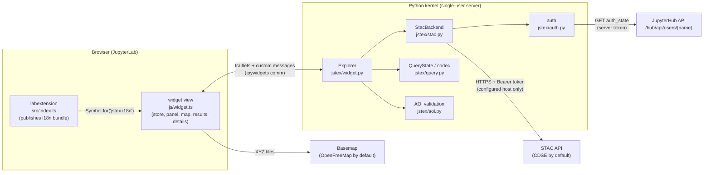
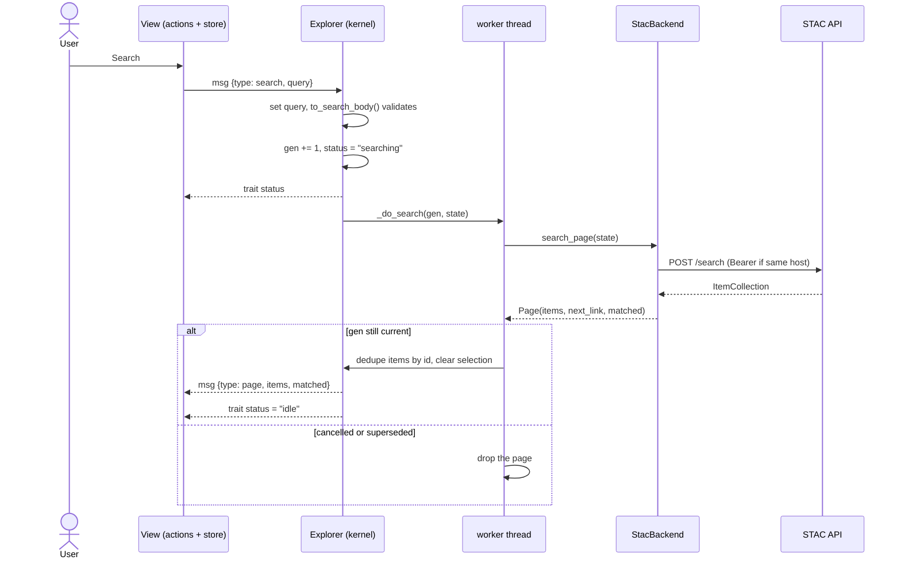
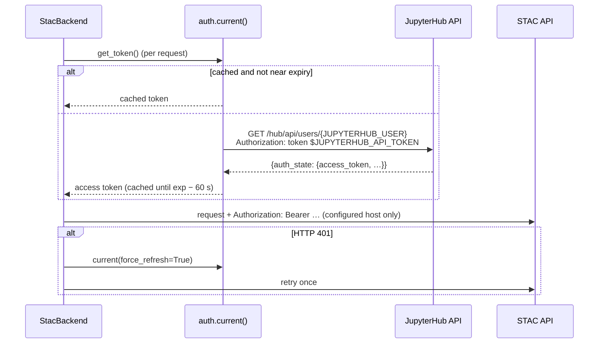

# jstex architecture

This document describes how jstex is built: what runs where, how the parts
talk to each other, and why. For setup, commands and gotchas see
[DEVELOPMENT.md](../DEVELOPMENT.md); for what users get see the
[README](../README.md).

## 1. Scope

jstex is a STAC explorer that lives inside a notebook cell. A user picks
collections, dates, one area of interest and attribute filters, searches a
STAC API, browses results on a map and in a table, and copies item links,
property values and asset hrefs — or reads the results in Python as `pystac`
objects.

Out of scope: downloads, visualisation, processing, workspaces (those stay in
STEX).

Stage 1 (v0.1) delivers the in-cell widget. The code is arranged for two
follow-ups: stage 2 (load more, S3 keys) and stage 3 (a JupyterLab side panel
with a REST backend).

## 2. The one rule: the kernel owns traffic and secrets

Every STAC request is made by the Python kernel. The browser only renders.

- The user's access token is read in the kernel from the JupyterHub API and is
  never sent to the browser.
- The same code path serves the widget and plain Python (`ex.search()`,
  `jstex.item(href)`), so what the widget shows is exactly what Python gets.
- The browser talks to only two kinds of servers: the Jupyter server (widget
  comms) and the basemap tile servers.

## 3. What ships in the wheel

One wheel, `jupyterlab_jstex-<version>-py3-none-any.whl` (distribution
`jupyterlab-jstex`, import package `jstex`), contains four things:

| Artefact                                                        | Source                                  | Built by                                 | Loaded by                                                   |
| --------------------------------------------------------------- | --------------------------------------- | ---------------------------------------- | ----------------------------------------------------------- |
| Python package `jstex`                                          | `jstex/*.py`                            | hatchling                                | the kernel (`import jstex`)                                 |
| Widget bundle `jstex/static/widget.{js,css}`                    | `js/`                                   | Vite library build (`jlpm build:widget`) | anywidget, from a blob URL, once per `Explorer()`           |
| JupyterLab extension `jupyterlab-jstex` (`jstex/labextension/`) | `src/index.ts`, `src/icon.ts`, `style/` | `tsc` + `jupyter-builder`                | JupyterLab at page load                                     |
| Translations `jstex/locale/`                                    | `js/strings.ts` → `jstex.pot`           | `jupyterlab-translate`                   | the Jupyter server, via the `jupyterlab.locale` entry point |

Notes:

- **Widget bundle.** It must be a single ES module: anywidget imports it from
  a blob URL, so no code-split chunks (`inlineDynamicImports`) and one CSS
  file. It is about 4.2 MB (1.1 MB gzip) because it includes OpenLayers and
  the EOX Elements.
- **Why a labextension at all.** The widget is not a JupyterLab plugin and
  cannot request `ITranslator`. In stage 1 the labextension loads the `jstex`
  translation bundle and publishes it for the widget (§14), and registers the
  extension icon: STEX's logo as the LabIcon `jupyterlab-jstex:logo`
  (`src/icon.ts`, exported as `stexIcon` for the stage-3 panel/launcher).
- **Server extension.** `jstex/routes.py` and `src/request.ts` are the
  extension template's authenticated `/jstex/hello` route. They are kept as
  the scaffold for stage 3's REST backend and are unused by the widget.

## 4. Python modules

| Module              | Responsibility                                                                                                                                                                     |
| ------------------- | ---------------------------------------------------------------------------------------------------------------------------------------------------------------------------------- |
| `jstex/__init__.py` | Lazy exports (`Explorer`, `item`) so the server can import the package cheaply (the translation entry point imports it).                                                           |
| `jstex/widget.py`   | `Explorer` (anywidget): synced traitlets, the message handler, search generations, Python accessors.                                                                               |
| `jstex/stac.py`     | `StacBackend`: every HTTP call to STAC, via pystac-client's `StacApiIO`: collections (paged), queryables (cached, merged), search, `rel=next`, item read. Retries, error messages. |
| `jstex/auth.py`     | Token provider chain: hub `auth_state` → `JSTEX_ACCESS_TOKEN` → anonymous. Caching and forced refresh.                                                                             |
| `jstex/query.py`    | `QueryState`, the STEX-compatible `?q=` codec, and `to_search_body()` (QueryState → STAC `/search` body incl. CQL2-JSON).                                                          |
| `jstex/aoi.py`      | GeoJSON upload validation and normalisation; geometry repair (`make_valid`).                                                                                                       |
| `jstex/config.py`   | `load_config()`: kwargs → `JSTEX_*` env vars → defaults. Basemaps.                                                                                                                 |
| `jstex/api.py`      | `jstex.item(href)`: open any item with the user's token (used by copied snippets).                                                                                                 |
| `jstex/errors.py`   | `JstexError` → `JstexAuthError`, `JstexStacError(status)`, `JstexQueryError`.                                                                                                      |

## 5. Front-end modules

The widget is framework-free TypeScript: a small observable store plus views
that render into plain DOM, with EOX custom elements for the map.

| Module                                                                     | Responsibility                                                                                                                   |
| -------------------------------------------------------------------------- | -------------------------------------------------------------------------------------------------------------------------------- |
| `js/define-guard.ts`                                                       | **First import.** Makes re-defining a custom element a no-op (each `Explorer()` re-evaluates the bundle).                        |
| `js/widget.ts`                                                             | anywidget `render()`: builds the layout, creates one store, backend and actions per view, mounts the views, returns the cleanup. |
| `js/store.ts`                                                              | `createStore()`: `get` / `set(patch)` / `subscribe((state, prev) => …)`.                                                         |
| `js/types.ts`                                                              | Shared types; mirrors the Python protocol.                                                                                       |
| `js/backend.ts`                                                            | `Backend` interface and `CommBackend` (request/reply over custom messages; search is push-based).                                |
| `js/model-sync.ts`                                                         | Initial state from the model; mirrors trait changes into the store; applies result pages.                                        |
| `js/actions.ts`                                                            | User intents. The only place views change state or talk to the backend.                                                          |
| `js/filters.ts`                                                            | Pure filter logic: operators by field type, value parsing, validation, rows ↔ predicates.                                        |
| `js/format.ts`                                                             | Formatting and geometry helpers (bbox, area, dates, footprint features).                                                         |
| `js/antimeridian.ts`                                                       | Splits footprints crossing ±180° (copied from STEX).                                                                             |
| `js/theme.ts`                                                              | Host theme detection and watching; basemap layer.                                                                                |
| `js/i18n.ts`, `js/strings.ts`                                              | Translation lookup; every UI string as a literal `trans.__()` call.                                                              |
| `js/selection.ts`, `js/clipboard.ts`, `js/snippets.ts`, `js/icons.ts`      | Small helpers.                                                                                                                   |
| `js/ui/panel.ts`                                                           | Search panel: collapsible sections, pinned Search button with a "why disabled" hint, collapse to an icon rail.                   |
| `js/ui/section.ts`                                                         | Generic collapsible section (caret, title, summary, badge).                                                                      |
| `js/ui/layout.ts`                                                          | Theme and height, the panel/map splitter (drag, arrow keys, double-click resets) and the collapsible map.                        |
| `js/ui/collections.ts`, `dates.ts`, `aoi-section.ts`, `filters-section.ts` | The four panel sections. Dates use `vanilla-calendar-pro` (as STEX) for the date + 24 h time popup.                              |
| `js/ui/map.ts`                                                             | `eox-map` + `eox-drawtools`: basemap, AOI, footprints, highlight; click-to-activate; drawing.                                    |
| `js/ui/footprint-popup.ts`                                                 | List of items under a clicked point when footprints overlap.                                                                     |
| `js/ui/results.ts`                                                         | Results table (checkbox selection, row activation).                                                                              |
| `js/ui/details.ts`                                                         | Item details: header actions, Prev/Next, Properties / Assets / Links with copy buttons.                                          |

Everything is per view: nothing is module-global except the define guard and
the translation lookup. That is why two explorers (or two views of one
explorer) in a notebook are independent.

## 6. The widget protocol

Two channels connect a view and its `Explorer`.

### 6.1 Synced traitlets (small state, both directions)

| Trait             | Type                             | Written by                | Meaning                                                            |
| ----------------- | -------------------------------- | ------------------------- | ------------------------------------------------------------------ |
| `query`           | dict                             | JS (on Search) and Python | The QueryState dict (same keys as `QueryState.to_dict()`).         |
| `selected_ids`    | list[str]                        | JS                        | Checked result rows → `ex.selected_items`.                         |
| `active_id`       | str \| None                      | JS                        | Item shown in details → `ex.selected_item`.                        |
| `status`          | `idle` \| `searching` \| `error` | Python                    | Search state.                                                      |
| `error`           | str                              | Python                    | Message for the error banner.                                      |
| `auth_source`     | `hub` \| `env` \| `anonymous`    | Python                    | Drives the "Not signed in" hint.                                   |
| `can_cancel`      | bool                             | Python                    | False when searches run synchronously.                             |
| `map_height`      | int                              | Python / JS               | Panel + map height (drag-resizable).                               |
| `basemap`         | dict                             | Python                    | Light/dark URL (key applied), attribution, `kind` (`style`/`xyz`). |
| `panel_collapsed` | bool                             | JS                        | Panel folded to the rail.                                          |
| `panel_width`     | int                              | JS / Python               | Search panel width in px (divider drag; clamped by layout).        |
| `map_collapsed`   | bool                             | JS / Python               | Map folded to a rail (never together with `panel_collapsed`).      |

### 6.2 Custom messages (requests and large payloads)

Results are sent as messages, not traits: one page of CDSE items can be
several MB, and a trait would be stored in, and re-sent with, the widget
state.

| Direction | `type`        | Payload                           | Answer                                                          |
| --------- | ------------- | --------------------------------- | --------------------------------------------------------------- |
| JS → Py   | `collections` | `req_id`                          | `reply` with `[{id, title, description, license, start, end}]`  |
| JS → Py   | `queryables`  | `req_id`, `collections`           | `reply` with the fields shared by all collections               |
| JS → Py   | `aoi_upload`  | `req_id`, `text`                  | `reply` with one Polygon/MultiPolygon, or an error              |
| JS → Py   | `search`      | `query`                           | none directly; `status` changes, then `page`                    |
| JS → Py   | `cancel`      | —                                 | `status` → `idle`                                               |
| JS → Py   | `sync`        | —                                 | `page` with the current results (a re-rendered view catches up) |
| Py → JS   | `reply`       | `req_id`, `ok`, `data` \| `error` | resolves/rejects the pending request                            |
| Py → JS   | `page`        | `items`, `matched`                | replaces the view's results                                     |

Every request gets a `reply`: the handler catches all exceptions and turns
them into `ok: false`, so the UI never waits forever on a failed request.

## 7. Search flow

Design points:

- **Push-based.** Results always arrive as `page` messages, whoever started
  the search. `ex.search()` from Python updates every open view the same way.
- **Worker thread.** Searches run on a daemon thread (`thread_runner`), so the
  kernel stays free and Cancel works. The stage-1 spike showed that `send()`
  and trait updates from a thread reach the browser reliably (ipykernel 7.4);
  `spike.spec.ts` guards it. `sync_runner` exists as a fallback and sets
  `can_cancel = False`.
- **Cancel = generation counter.** `cancel()` and every new search increment
  `_gen` under a lock. A finishing search whose generation is stale is dropped;
  previous results stay. The HTTP request itself is not aborted.
- **Kernel busy.** Comm messages are handled by the kernel's main loop, so
  while another cell runs, the widget waits.

### 7.1 From QueryState to `/search`

`to_search_body()` in `jstex/query.py`:

| QueryState                 | Request body                                                                                                                   |
| -------------------------- | ------------------------------------------------------------------------------------------------------------------------------ |
| `collections` (required)   | `collections`                                                                                                                  |
| `pageSize`                 | `limit`                                                                                                                        |
| `datetime` with either end | `datetime: "from/to"`; a missing end becomes `1900-01-01T00:00:00Z` or `2099-12-31T23:59:59Z` (the CDSE firewall rejects `..`) |
| selected `aois`            | `intersects`: the geometry after `repair()`; several (only possible from a STEX link) are unioned                              |
| `filters`                  | `filter` (CQL2-JSON) + `filter-lang: cql2-json`; one predicate or `and`; `!=` → `<>`, `IN` → `in` (CDSE rejects the others)    |

`sort` is kept in the QueryState for STEX compatibility but not sent.

## 8. State model

There are three layers of state, each with a clear owner:

1. **Kernel (source of truth).** The traitlets in §6.1 plus `_items` (the
   loaded items by id) and `_page`. The Python accessors read from here.
2. **View store (`ExplorerState`, `js/types.ts`).** A per-view copy of the
   traits, plus the results from `page` messages and derived data (collections
   list, filter fields). `model-sync.ts` keeps it in step: trait changes made
   in Python are mirrored into the store; `applyPage` replaces the items and
   keeps selection that still refers to loaded items.
3. **UI-only state (in the store, never synced).** Filter builder rows with
   their raw text and errors, open/closed sections, the active draw tool, AOI
   upload errors. Only valid filter rows are committed to `query.filters`.

Views subscribe to the store and re-render the parts they own. They change
state only through `Actions`; an action updates the store and, where Python
cares, sets the trait and calls `save_changes()`.

### 8.1 Links: GET search URL and STEX link

`ex.query_url()` (`search_get_url()` in `jstex/query.py`) turns the same
`to_search_body()` result into a STAC `GET /search` URL:

- `collections` comma-joined, `limit` and `datetime` as-is;
- `intersects` and `filter` as compact JSON, with `filter-lang=cql2-json`;
- coordinates rounded to 6 decimals.

CDSE answers the GET form exactly like the POST (verified 2026-09-30), but its
firewall rejects URLs over about 2,000 characters with an HTML "Request
Rejected" page. When the area pushes the URL over `MAX_GET_URL_LENGTH` (2,000),
the link sends the area's `bbox` instead and warns that it may return extra
items. The URL carries no token, so restricted collections need a signed-in
client. Both methods return a `Url` (a `str` with `_repr_html_`), which
notebooks show as a clickable link.

`QueryState` is the same shape as STEX's (`collections`, `datetime`, `aois`,
`filters`, `sort`, `pageSize`). `ex.stex_url()` (needs `JSTEX_STEX_URL`)
encodes it with the STEX `?q=` codec: base64url JSON, compact AOIs `[{g, s}]`, defaults omitted,
coordinates rounded to 6 decimals with JavaScript `Math.round` semantics. The
codec is tested against golden strings produced by STEX's own encoder
(`tests/fixtures/stex_codec_golden.json`), so a link opens the same search in
STEX.

## 9. Authentication

- **Where the token comes from.** OAuthenticator keeps the user's OIDC tokens
  in the encrypted `auth_state`. The single-user server reads it with its own
  API token, which needs the RBAC scope `admin:auth_state!user`. It must use
  `/hub/api/users/{name}`: `/hub/api/user` returns `auth_state: null`
  (jupyterhub#5103).
- **Fallbacks.** Next is `JSTEX_ACCESS_TOKEN` (local development), then
  anonymous. Each problem (hub unreachable, 403, no token, non-JSON answer) is
  warned about once, and jstex continues anonymously; the widget shows "Not
  signed in".
- **Caching.** The token is cached until 60 s before its JWT `exp` (at least
  15 s); an anonymous result is cached for 60 s. The hub refreshes the
  upstream token at most every `auth_refresh_age` seconds.
- **Token scoping.** The token is injected by a pystac-client request modifier
  only when the request's scheme, host and port equal the configured STAC
  URL. Item self links and `rel=next` hrefs come from the server and may point
  anywhere, so they do not get the token unless they are on that host.
- Only the access token leaves `auth.py`; the refresh token is never read.

## 10. STAC client details

- **Collections.** `GET /collections`, following `rel=next` (max 50 pages),
  deduplicated, sorted by title. Each gives id, title, description, license
  and temporal extent.
- **Queryables.** `GET /collections/{id}/queryables`, cached per collection
  for the life of the backend. `merged_queryables()` returns the fields present
  in every selected collection with the same type (string, number, integer,
  boolean), keeping an enum only if all collections agree. Space, time and
  bookkeeping fields are excluded (they have their own controls).
- **Pagination.** `next_page()` follows the `rel=next` link exactly (method,
  body, `merge`) via pystac-client. The widget does not use it yet ("Load
  more" is stage 2).
- **Retries.** urllib3 `Retry`: 4 attempts with backoff on 429/502/503/504,
  POST included, honouring `Retry-After`.
- **Errors.** Everything becomes `JstexStacError` with a readable message:
  401/403 → "Not authorised", 429 → "Rate limited". A non-JSON 200 (CDSE's
  firewall answers some inputs with an HTML "Request Rejected" page) → "non-JSON
  response".

## 11. Area of interest

jstex keeps exactly one AOI; a new one replaces the old one.

- **Draw.** `eox-drawtools` is bound to the view's own `eox-map` (not a
  document selector), in Polygon or Box mode. The finished feature is read
  from the `drawupdate` event and stored in `query.aois`; drawtools' own copy
  is discarded, and the `aoi` layer renders from state. Changing the draw type
  rebuilds drawtools' interaction asynchronously, so drawing starts after
  `updateComplete`.
- **Upload.** The file text is sent to the kernel (`aoi_upload`).
  `parse_aoi_upload()` accepts a Feature, FeatureCollection or bare geometry;
  keeps only polygonal geometries; collects several into one MultiPolygon
  (no union); rejects non-WGS84 CRS, bad coordinates, unclosed rings and files
  over 5 MB. The view replaces the AOI only on success, so a rejected file
  never changes the current area.
- **Repair.** At search time `repair()` makes invalid polygons valid (e.g. a
  self-crossing drawing), because CDSE fails on them with
  `GEOSIntersects: TopologyException`.

## 12. Map

`eox-map` holds the basemap and three data layers: `aoi`, `footprints` and
`highlight` (the active item). Data layers are rebuilt from the store as
GeoJSON data URLs.

- **Basemap.** Default OpenFreeMap Positron in both themes, a vector style
  drawn by eox-map's `MapboxStyle` layer (ol-mapbox-style; only that layer
  type is registered). A deployment may configure an XYZ raster template or
  another style per theme (`kind` in the `basemap` trait). Style and XYZ
  basemaps are separate layers (`basemap-style` / `basemap-xyz`) below the
  data (`zIndex: -1`); a theme switch between kinds hides one, shows the
  other.
- **Controls.** Zoom and a collapsible attribution, restyled to the widget's
  look through a `<style>` added to eox-map's shadow root.

- Footprints are drawn only for loaded items, split at the antimeridian.
- A click on the map lists every footprint under the point. One item →
  activate it; several → the footprint popup lets the user pick, as in STEX.
- The active item is highlighted, and its results row and details follow.
- The map and panel share one height, resizable by dragging (`map_height`).

## 13. Layout and theming

- **Layout A.** The search panel sits beside the map, separated by a 12 px
  splitter; results and item details follow below. Dragging the splitter sets
  `panel_width` (default 300 px, at least 240 px, always leaving the map
  320 px; the grid clamps it too when the cell shrinks). The panel can fold to
  an icon rail with badges, or the map can fold to a rail on the right
  ("Hide map" / "Show map"), never both. Drawing an area or zooming to it
  brings the map back; an upload does not. CSS container queries react to the
  cell width, not the window: below 760 px the panel stacks above the map (no
  splitter; a hidden map becomes a bar), and below 600 px the results table
  drops the collection column.
- **Dates.** From/To are text fields (`YYYY-MM-DD [HH:MM]`, UTC) that open a
  `vanilla-calendar-pro` popup with a 24 h time picker, as in STEX. Without a
  time, From starts the day and To ends it. The popup is appended to `<body>`
  (outside the widget), so it gets the widget colours as inline custom
  properties.
- **Theme.** `js/theme.ts` follows the host: JupyterLab
  (`body[data-jp-theme-light]`), VS Code, Colab, then the OS preference. It
  watches for changes and sets `data-theme` on the widget root. All colours are
  CSS custom properties with light and dark values; the basemap switches too.

## 14. Internationalisation

jstex follows the JupyterLab standard for extensions:

1. Strings live in `js/strings.ts` as literal `trans.__()` / `trans._n()` calls
   (the extractor finds only those).
2. `jlpm i18n:extract` writes `jstex/locale/jstex.pot`.
3. Translations ship in `jstex/locale/<ll_CC>/LC_MESSAGES/jstex.{po,json,mo}`
   and are registered by the `jupyterlab.locale` entry point.
4. At page load the labextension calls `translator.load('jstex')` and
   publishes the bundle under `Symbol.for('jstex.i18n')`.
5. `js/i18n.ts` reads it, or falls back to English (VS Code, Colab, Voilà).

JupyterLab serves a package's translations only for languages whose official
language pack is installed. Kernel-side error messages are English.

## 15. Testing

| Layer      | Tool                 | Where                             | Covers                                                                                                                                                                                                    |
| ---------- | -------------------- | --------------------------------- | --------------------------------------------------------------------------------------------------------------------------------------------------------------------------------------------------------- |
| Python     | pytest + `responses` | `tests/`                          | config, auth chain (hub mocked), AOI rules, query codec (STEX golden fixtures), search body, STAC client (retries, errors, token scoping), widget protocol (fake backend, sync runner)                    |
| Front end  | vitest + jsdom       | `js/__tests__/`, `src/__tests__/` | store/actions/model sync, filters, formatting, every panel section, map glue, results, details, popup, i18n, define guard                                                                                 |
| End to end | Galata (Playwright)  | `ui-tests/tests/`                 | real JupyterLab + kernel against `ui-tests/fake_stac.py` (a deterministic STAC stub; `/__last_search` exposes the last request body): spikes, search, draw, upload, filters, details, two explorers, i18n |

`design.spec.ts` captures design-review screenshots when
`JSTEX_DESIGN_SHOTS=1`; it asserts nothing.

## 16. CI and release

- `build.yml` (push and PR): lint, vitest, install + pytest, server/lab
  extension checks and `jupyterlab.browser_check`, the "all endpoints
  authenticated" check, wheel/sdist, an isolated install test, the Galata
  suite, and a link check of the Markdown files.
- `release.yml` (push of a `v*` tag): builds the wheel and attaches it to a
  GitHub Release. jstex is private: no PyPI or npm. Hub images install the
  wheel from the release (README → Installation).
- The version comes from `package.json` (`hatch-nodejs-version`).

## 17. Extension points

- **`Backend` interface (`js/backend.ts`).** Views depend only on it. Stage 3
  adds a REST implementation for a JupyterLab side panel, served by the server
  extension (`jstex/routes.py`), next to `CommBackend`.
- **Pagination.** `StacBackend.next_page()` and `Page.next_link` exist; stage 2
  adds "Load more" on top (append and deduplicate by id).
- **Auth chain.** `auth._resolve()` is the single place to add another token
  source (e.g. S3 key minting in stage 2).
- **Config.** New deployment settings go through `load_config()` as `JSTEX_*`
  environment variables.
